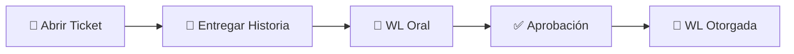

# 📋 Whitelist

## 🎯 Sistema de Whitelist y Segundo Slot

***


**¿Qué es la Whitelist?** Es un sistema de verificación que te permite acceder a funcionalidades avanzadas del servidor, como unirte a facciones y obtener un segundo personaje.


***

## 📝 Requisitos para Whitelist

La Whitelist (WL) es **necesaria** en los siguientes casos:

| Requisito | Descripción |
|-----------|-------------|
| **🏛️ Facciones Legales** | LSPD, Sheriff, FIB, EMS, Bomberos |
| **💀 Facciones Ilegales** | Organizaciones Delictivas (OD) |
| **🛠️ Equipo Staff** | Para formar parte del equipo administrativo |
| **👤 Segundo Slot** | Para crear tu segundo personaje |

***

## 🎤 Proceso de Obtención

### 📋 Paso a Paso

### 1️⃣ Apertura de Ticket


**Primer Paso:** Abre un ticket en el canal correspondiente de nuestro [Discord Oficial](https://discord.gg/gxKUeAgEs2)


### 2️⃣ Historia del Personaje

* 📖 Redacta la **historia completa** de tu personaje principal
* ✍️ Incluye: Origen, motivaciones, personalidad, objetivos
* 🎯 Debe ser **coherente y realista**
* ✅ Espera la **aprobación** del staff

### 3️⃣ Entrevista Oral

* 🎤 La WL se realiza de manera **oral** (por voz)
* 📅 Horarios asignados según disponibilidad del staff
* ⏰ Se coordina mediante ticket
* 💬 Demuestra conocimiento de normativa y tu personaje

***

## 👥 Segundo Slot

### 🎉 Beneficios

Una vez obtenida tu Whitelist, puedes solicitar un **segundo personaje** para expandir tus posibilidades de roleplay.


**Ventaja:** Experimenta diferentes historias y roles sin perder tu personaje principal.


***

### 📜 Requisitos del Segundo Slot

#### ✅ Obligatorios

<table>
<thead>
<tr>
<th width="200">Requisito</th>
<th>Descripción</th>
</tr>
</thead>
<tbody>
<tr>
<td><strong>📖 Historia Aprobada</strong></td>
<td>Enviar historia completa vía ticket en <a href="https://discord.gg/gxKUeAgEs2">Discord</a></td>
</tr>
<tr>
<td><strong>🚫 Sin Relación</strong></td>
<td>NO puede tener relación sanguínea ni de ningún tipo con tu slot principal</td>
</tr>
<tr>
<td><strong>💼 Locales Diferentes</strong></td>
<td>No puede trabajar en el mismo local que tu personaje principal</td>
</tr>
<tr>
<td><strong>⚖️ Sin Doble Facción</strong></td>
<td>Si uno está en OD, el otro NO puede estar en facciones legales</td>
</tr>
</tbody>
</table>

***

### 🚫 Restricciones Importantes

#### Doble Facción NO Permitida


**Prohibido:** Si uno de tus personajes pertenece a una **OD** (Organización Delictual), el otro **NO** puede pertenecer a:


* 👮 **LSPD** - Departamento de Policía
* 🤠 **Sheriff** - Oficina del Sheriff
* 🕴️ **FIB** - Agencia Federal
* 🚒 **Bomberos** - Cuerpo de Bomberos
* 🏥 **EMS** - Servicios Médicos de Emergencia

#### 💼 Restricción de Locales


**Importante:** Ambos personajes NO pueden:
- Trabajar en el mismo local comercial
- Ser dueños del mismo establecimiento
- Compartir negocios o emprendimientos


#### 👨‍👩‍👧‍👦 Restricción de Relaciones


**Importante:** Tus dos personajes NO pueden:
- Ser familiares (hermanos, primos, padres, hijos)
- Conocerse entre sí
- Compartir historias o trasfondos relacionados
- Interactuar de ninguna manera IC


***

## ⚖️ Consecuencias del Mal Uso


**SANCIÓN GRAVE:** Si eres sorprendido utilizando tu segundo personaje de manera inapropiada:

🚫 **Pérdida inmediata del rango WL**  
🚫 **Eliminación de tu segundo slot**  
🚫 **Posible sanción administrativa adicional**


***

## 📋 Ejemplos de Mal Uso

| ❌ Situación Prohibida | 📝 Descripción |
|------------------------|----------------|
| **🔄 Metagaming** | Pasar información entre tus personajes |
| **💰 Transferencias** | Darse dinero o items entre slots |
| **🤝 Colaboración** | Ayudarse mutuamente tus personajes |
| **👥 Interacción** | Rolear con ambos personajes juntos |
| **📍 Misma zona** | Usar ambos personajes en el mismo lugar/situación |

***

## ✅ Buenas Prácticas


**Para mantener tu WL en buen estado:**

1. 📖 **Desarrolla** historias independientes y únicas
2. 🔒 **Mantén** separación total entre personajes
3. 🎭 **Interpreta** cada uno con personalidad distinta
4. ⏰ **Alterna** el uso de tus personajes responsablemente
5. 📝 **Documenta** el progreso de cada uno
6. 🤝 **Respeta** las normas de doble slot


***

## 🎯 Proceso de Solicitud - Resumen

### 🔄 Flujo Completo



### Obtención de WL Base

**Pasos:**
1. 🎫 Abrir ticket en [Discord](https://discord.gg/gxKUeAgEs2)
2. 📝 Enviar historia del personaje principal
3. ⏰ Esperar asignación de horario
4. 🎤 Completar entrevista oral
5. ✅ Recibir aprobación

**Requisitos:**
- Historia coherente y detallada
- Conocimiento de normativa básica
- Disponibilidad para entrevista
- Compromiso con el servidor


**Tiempo estimado:** 1-3 días según disponibilidad




### Solicitud de Segundo Personaje

**Pasos:**
1. 🎫 Abrir ticket específico para segundo slot
2. 📖 Enviar historia del nuevo personaje
3. ✅ Esperar aprobación administrativa
4. 🎮 Crear personaje en el servidor
5. 🌟 ¡Comenzar nueva historia!

**Verificaciones:**
- ✅ Historia diferente e independiente
- ✅ Sin relaciones con personaje principal
- ✅ Diferente trabajo/local
- ✅ Cumple restricción de facciones


**Una vez aprobado:** Podrás alternar entre tus personajes libremente




### Unirse al Equipo Staff

**Requisitos Adicionales:**
- ✅ Whitelist activa y en buen estado
- ✅ Sin sanciones recientes
- ✅ Conocimiento profundo de normativa
- ✅ Experiencia en el servidor
- ✅ Madurez y profesionalismo

**Proceso:**
1. 🎫 Ticket de solicitud staff
2. 📋 Formulario de aplicación
3. 🎤 Entrevista con administración
4. 📚 Período de prueba
5. 🛠️ Capacitación inicial


**Importante:** El staff debe mantener imparcialidad y profesionalismo en todo momento




### Unirse a Facciones (Legal/Ilegal)

**Para Facciones Legales:**
- 🎯 WL aprobada
- 📋 Historia coherente con la facción
- 🎤 Entrevista IC con líderes
- ✅ Aprobación de jefatura

**Para Organizaciones Delictuales:**
- 🎯 WL aprobada
- 🔍 Ser invitado por miembros
- 📖 Historia compatible con vida criminal
- ✅ Aprobación de líder de OD


**Recuerda:** Si tienes un personaje en OD, el otro NO puede estar en facción legal




***

## 📞 Contacto y Soporte

¿Tienes dudas sobre el proceso de Whitelist?

| Canal | Uso |
|-------|-----|
| 💬 [**Discord Oficial**](https://discord.gg/gxKUeAgEs2) | Tickets y consultas generales |
| 🎫 **Sistema de Tickets** | Solicitudes de WL y segundo slot |
| 🛠️ **Canal de Ayuda** | Preguntas frecuentes |

***

## ❓ Preguntas Frecuentes

<strong>¿Cuánto tiempo toma obtener la WL?</strong>

Generalmente entre **1-3 días** dependiendo de la disponibilidad del staff. Los horarios se coordinan según tu disponibilidad y la del equipo administrativo.

<strong>¿Puedo perder mi Whitelist?</strong>

Sí, puedes perder tu WL por:
- Uso indebido del segundo slot
- Sanciones graves de normativa
- Metagaming entre personajes
- Falta de compromiso con el rol

<strong>¿Mi segundo personaje puede conocer a personas que conoce el primero?</strong>

Sí, PERO deben actuar como completos desconocidos. No puede haber **ninguna relación** entre tus personajes, ni siquiera indirecta.

<strong>¿Puedo usar ambos personajes el mismo día?</strong>

Sí, puedes alternar entre ellos, pero NUNCA usar ambos en la misma situación o para beneficio mutuo.

<strong>¿Necesito WL para jugar en el servidor?</strong>

No necesariamente. La WL es **obligatoria** solo para:
- Ingresar a facciones (legales o ilegales)
- Obtener segundo slot
- Aplicar a staff

***

## 🌟 ¡Únete a la Comunidad Whitelisted! 🌟

**La Whitelist es tu puerta a experiencias de roleplay más profundas**

### [🎫 Solicitar Whitelist Ahora](https://discord.gg/gxKUeAgEs2)

***

*Recuerda: Con grandes privilegios vienen grandes responsabilidades*

